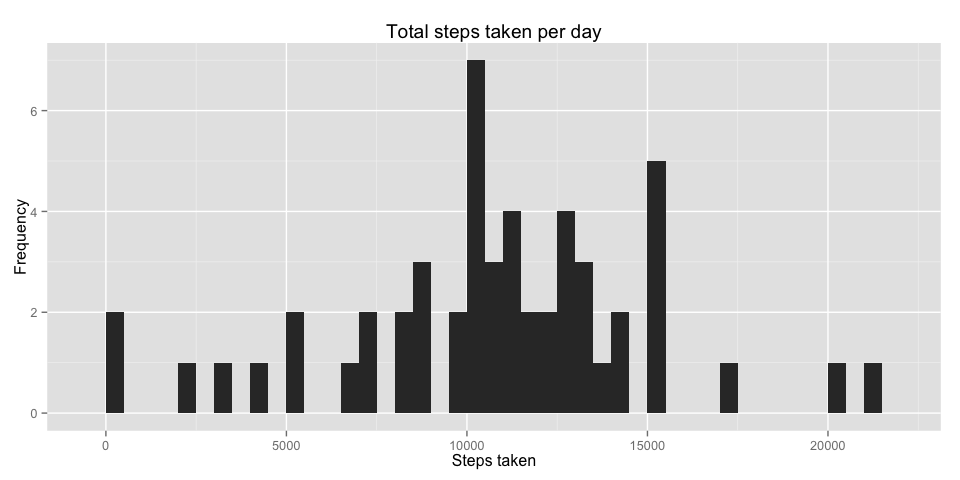
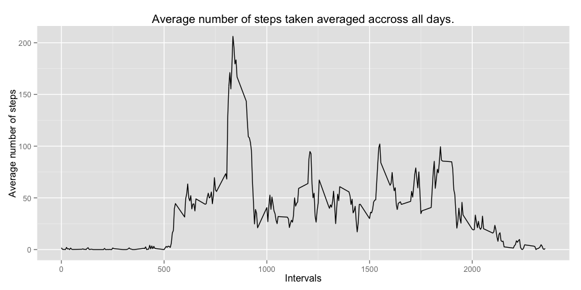
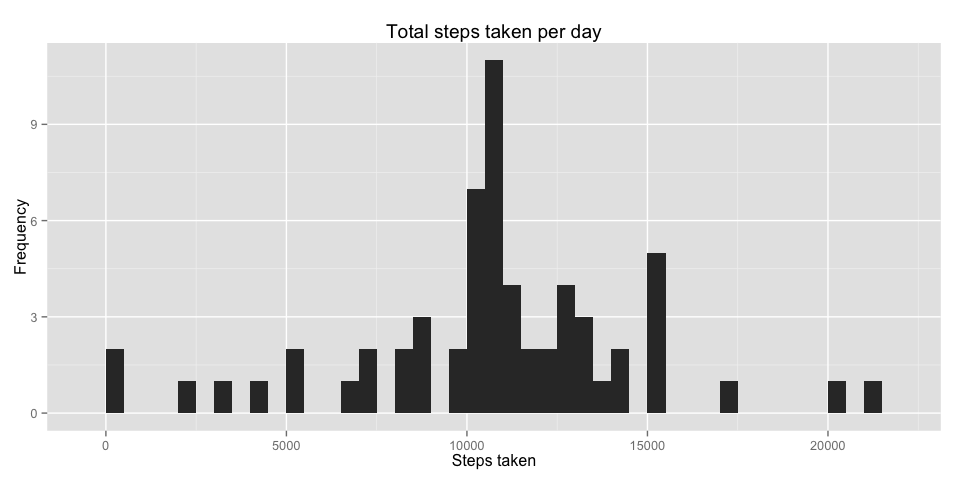

# Reproducible Research: Peer Assessment 1


## Loading and preprocessing the data

We unzip the 'activity.zip' file and read in the 'activity.csv' file using the read.csv() function. Print out the first 6 rows to get a feel for the data.


```r
data_zipped <- 'activity.zip'
data <- read.csv(unz(data_zipped, 'activity.csv'))
head(data)
```

```
##   steps       date interval
## 1    NA 2012-10-01        0
## 2    NA 2012-10-01        5
## 3    NA 2012-10-01       10
## 4    NA 2012-10-01       15
## 5    NA 2012-10-01       20
## 6    NA 2012-10-01       25
```

## What is mean total number of steps taken per day?

### 1: Calculate the total number of steps taken per day

To answer this question we need to group the steps values by date. Afterwards we calculate the total steps of those groups by using the sum() function. Clean up and print the answers.


```r
library(plyr)
totals <- ddply(data, 'date', summarize, totalSteps = sum(steps))
head(totals, 20)
```

```
##          date totalSteps
## 1  2012-10-01         NA
## 2  2012-10-02        126
## 3  2012-10-03      11352
## 4  2012-10-04      12116
## 5  2012-10-05      13294
## 6  2012-10-06      15420
## 7  2012-10-07      11015
## 8  2012-10-08         NA
## 9  2012-10-09      12811
## 10 2012-10-10       9900
## 11 2012-10-11      10304
## 12 2012-10-12      17382
## 13 2012-10-13      12426
## 14 2012-10-14      15098
## 15 2012-10-15      10139
## 16 2012-10-16      15084
## 17 2012-10-17      13452
## 18 2012-10-18      10056
## 19 2012-10-19      11829
## 20 2012-10-20      10395
```

### 2: Make a histogram of the total number of steps taken each day

We'll use the ggplot2 package to draw our histogram, this will give us a graphical overview of the distribution of the total steps taken per day.


```r
library(ggplot2)
ggplot(totals, aes(x = totalSteps)) +
  geom_histogram(binwidth = 500) +
  ggtitle("Total steps taken per day") +
  xlab("Steps taken") + 
  ylab("Frequency")
```

 

### 3: Calculate and report the mean and median of the total number of steps taken per day

Since we already calculated the total steps for each day, we can now use that data as input for the mean() and median() functions, make sure to drop the NA values.


```r
mean(totals$totalSteps, na.rm = TRUE)
```

```
## [1] 10766.19
```

```r
median(totals$totalSteps, na.rm = TRUE)
```

```
## [1] 10765
```

## What is the average daily activity pattern?

### 1: Make a time series plot (i.e. type = "l") of the 5-minute interval (x-axis) and the average number of steps taken, averaged across all days (y-axis)

We use the plyr package, group the data  by intervals and calculate the mean. We drop the NA values before calculating the mean. Display the 10 first values of the dataframe.


```r
series <- ddply(data, 'interval', summarize, meanSteps = mean(steps, na.rm = TRUE))
head(series, 10)
```

```
##    interval meanSteps
## 1         0 1.7169811
## 2         5 0.3396226
## 3        10 0.1320755
## 4        15 0.1509434
## 5        20 0.0754717
## 6        25 2.0943396
## 7        30 0.5283019
## 8        35 0.8679245
## 9        40 0.0000000
## 10       45 1.4716981
```

Now, use the data to draw a time series plot of the 5-minute intervals and the average number of steps taken, averaged accross all days.


```r
ggplot(series, aes(x = interval, y = meanSteps)) +
  geom_line() + 
  ggtitle("Average number of steps taken averaged accross all days.") +
  xlab("Intervals") + 
  ylab("Average number of steps")
```

 

### 2: Which 5-minute interval, on average across all the days in the dataset, contains the maximum number of steps?

An easy way to find this solution is the check for the maximum in the meanSteps column. Then use this value to subset our series dataframe to single out the rows containing the max value.


```r
series[series$meanSteps == max(series$meanSteps), ]
```

```
##     interval meanSteps
## 104      835  206.1698
```


## Imputing missing values

### 1: Calculate and report the total number of missing values in the dataset - the total number of rows with NAs

The easiest solution for this problem is to create a subset only containing rows with NA values, then we count the amount of rows in this new dataframe. 


```r
nrow(subset(data, is.na(data)))
```

```
## [1] 2304
```

### 2: Devise a strategy for filling in all of the missing values in the dataset

We'll use the average steps taken in each 5 minute interval averaged of the total amount of days to fill in NA values matching the same interval. We can do this since only the steps column contains mising values. We can use the sum() and is.na() function to demontrate that the date and interval columns do not have any missing data.


```r
sum(is.na(data$date))
```

```
## [1] 0
```

```r
sum(is.na(data$interval))
```

```
## [1] 0
```

### 3: Create a new dataset that is equal to the original dataset but with the missing data filled in

Reference the series dataframe to fill in the missing values as desribed.


```r
dataNAFixed <- data
dataNAFixed$steps <- ifelse(is.na(dataNAFixed$steps) == TRUE, series$meanSteps[series$interval %in% dataNAFixed$interval], dataNAFixed$steps)
head(dataNAFixed, 10)
```

```
##        steps       date interval
## 1  1.7169811 2012-10-01        0
## 2  0.3396226 2012-10-01        5
## 3  0.1320755 2012-10-01       10
## 4  0.1509434 2012-10-01       15
## 5  0.0754717 2012-10-01       20
## 6  2.0943396 2012-10-01       25
## 7  0.5283019 2012-10-01       30
## 8  0.8679245 2012-10-01       35
## 9  0.0000000 2012-10-01       40
## 10 1.4716981 2012-10-01       45
```

### 4: Make a histogram of the total number of steps taken each day and Calculate and report the mean and median total number of steps taken per day. Do these values differ from the estimates from the first part of the assignment? What is the impact of imputing missing data on the estimates of the total daily number of steps?

Calculate the total steps taken for each day.


```r
totalsNAFixed <- ddply(dataNAFixed, 'date', summarize, totalSteps = sum(steps))
head(totalsNAFixed, 10)
```

```
##          date totalSteps
## 1  2012-10-01   10766.19
## 2  2012-10-02     126.00
## 3  2012-10-03   11352.00
## 4  2012-10-04   12116.00
## 5  2012-10-05   13294.00
## 6  2012-10-06   15420.00
## 7  2012-10-07   11015.00
## 8  2012-10-08   10766.19
## 9  2012-10-09   12811.00
## 10 2012-10-10    9900.00
```
Draw the histogram using ggplot2.


```r
ggplot(totalsNAFixed, aes(x = totalSteps)) +
  geom_histogram(binwidth = 500) +
  ggtitle("Total steps taken per day") +
  xlab("Steps taken") + 
  ylab("Frequency")
```

 

Calculate the mean and the median.


```r
mean(totalsNAFixed$totalSteps, na.rm = TRUE)
```

```
## [1] 10766.19
```

```r
median(totalsNAFixed$totalSteps, na.rm = TRUE)
```

```
## [1] 10766.19
```

We see that the median has increased to the same value as our mean. Since mean and median are the same, we can expect to see a bell shape in our histogram. 

## Are there differences in activity patterns between weekdays and weekends?

### 1: Create a new factor variable in the dataset with two levels – “weekday” and “weekend” indicating whether a given date is a weekday or weekend day

We'll use the weekdays() function to deduct the day from our date column, if the weekday is a Saturday or Sunday, we'll classify that row as a weekend. If not we'll classify the row as a weekday.


```r
dataNAFixed$date <- as.Date(dataNAFixed$date)
dataNAFixed$weektype <- ifelse(weekdays(dataNAFixed$date) %in% c("Saturday", "Sunday"), "Weekend", "Weekday")
head(dataNAFixed)
```

```
##       steps       date interval weektype
## 1 1.7169811 2012-10-01        0  Weekday
## 2 0.3396226 2012-10-01        5  Weekday
## 3 0.1320755 2012-10-01       10  Weekday
## 4 0.1509434 2012-10-01       15  Weekday
## 5 0.0754717 2012-10-01       20  Weekday
## 6 2.0943396 2012-10-01       25  Weekday
```

### 2: Make a panel plot containing a time series plot of the 5-minute interval (x-axis) and the average number of steps taken, averaged across all weekday days or weekend days (y-axis)

We split our dataNAFixed dataframe by interval and weektype and apply the mean function to average the steps over all days.


```r
seriesNAFixed <- ddply(dataNAFixed, c("interval", "weektype"), summarize, meanSteps = mean(steps, na.rm = FALSE))
head(seriesNAFixed, 10)
```

```
##    interval weektype   meanSteps
## 1         0  Weekday 2.251153040
## 2         0  Weekend 0.214622642
## 3         5  Weekday 0.445283019
## 4         5  Weekend 0.042452830
## 5        10  Weekday 0.173165618
## 6        10  Weekend 0.016509434
## 7        15  Weekday 0.197903564
## 8        15  Weekend 0.018867925
## 9        20  Weekday 0.098951782
## 10       20  Weekend 0.009433962
```

Draw two graphs using the ggplot2 package.


```r
ggplot(seriesNAFixed, aes(x = interval, y = meanSteps)) +
  geom_line() +
  facet_grid(weektype ~ .) +
  ggtitle("Average number of steps taken averaged accross all days.") +
  xlab("Intervals") + 
  ylab("Average number of steps")
```

 

We see that in the week activity starts earlier versus the weekends. There is more activity during the day in the weekends versus the week.
